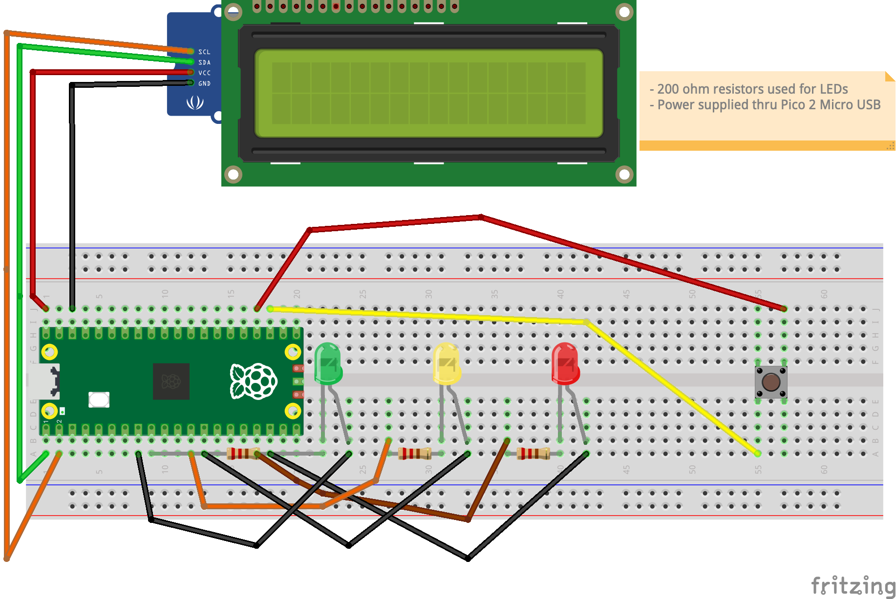

# Red Light Green Light

This is just a personal project to create a simple game for my kids to get them interested in learning electronics and coding.

The LCD API code was not written by me and I included the link to the Github repo in both classes. Here is the link the repo: https://github.com/T-622/RPI-PICO-I2C-LCD

This was written with my hardware in mind:
  - A breadboard (large enough to fit all the components)
  - Raspberry Pi Pico 2
  - I2C 1602 LCD (16 x 2)
  - 3 LEDs (red light, yellow light, and green light)
  - A push button (to start and stop the game)

When the button is pressed, the game starts with a message on the LCD and then the lights cycle randomly for a random amount of time for up to 10 seconds until the button is pressed again to end the game (where a message will be displayed).

## Breadboard/hardware Diagram
Below is a diagram of how I have my breadboard and hardware configured for this:

